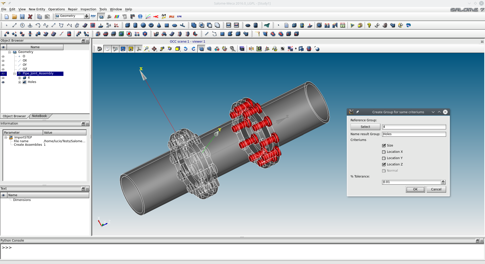

// SalomeGeomFilterGroup

A python script for creating Geometry groups in the GEOM module using features and properties of another group.

# Previews

Faces + Size options:

Solid + Size + location option:

# Videos
Youtube Video: https://www.youtube.com/watch?v=Nil1zQtyf_8

# News
25/10/16 - Upload first version

# Know Problems

# To Do
